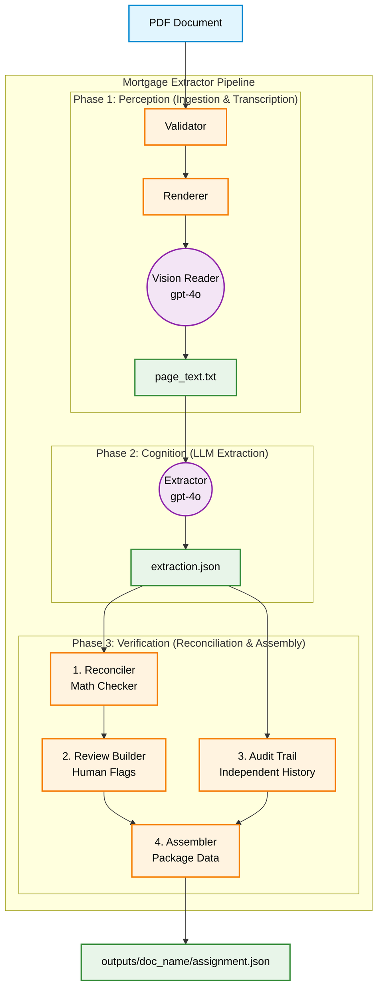

<div align="center">
  <h1>🏦 FinCap Document Pipeline</h1>
  <p><strong>An Intelligent, 3-Phase Pipeline for Extracting Structured Financial Data from Complex PDFs using Vision AI and Deterministic Math.</strong></p>
  
  [](#)
  [](#)
  [](#)
  [](#)
</div>

---

## 📖 Overview

The **FinCap Document Pipeline** (`mortgage-extractor`) solves the core issues inherent in legacy OCR pipelines and raw LLM extraction by intelligently splitting the problem of document understanding into three distinct responsibilities: **Perception**, **Cognition**, and **Verification**.

Whether dealing with loan estimates, complex appraisal documents, or documents with revision stamps and footnotes, this pipeline delivers high-fidelity, mathematically verified structured JSON outputs ready for downstream integration.

---

## ✨ Key Features

### 👁️ Phase 1: Ingestion & Vision Transcription (Perception)
* **Visual Context Retained:** Bypasses hidden PDF text layers by rendering high-quality 200 DPI images.
* **Spatial Understanding:** Uses OpenAI's `gpt-4o` Vision model to perfectly capture complex layouts, footnotes, and handwritten stamps.
* **Superior to OCR:** Overcomes the "reading order" problem that traditional tools (like Tesseract) struggle with.

### 🧠 Phase 2: LLM Data Extraction (Cognition)
* **Strict JSON Schemas:** Forces `gpt-4o` to output validated JSON.
* **Intelligent Corrections:** Automatically detects revision language (e.g., "supersedes", "REVISED") and logs the `original_value`, `correction_applied` flag, and `decision_reason`.
* **Formula Recognition:** Identifies mathematical relationships (e.g., LTV calculation) without performing the math itself, preventing arithmetic hallucinations.

### 🛡️ Phase 3: Deterministic Reconciliation (Verification)
* **Zero LLM Usage:** Fully deterministic Python pipeline using `decimal.Decimal` for precise arithmetic.
* **Reconciliation Flags:** Dynamically verifies extracted formulas and flags any discrepancies.
* **Human Review Signals:** Automatically generates priority flags (`critical`, `high`, `medium`) based on confidence and missing values.
* **Immutable Audit Trail:** Logs model versions and prompt versions used for extraction, ensuring full compliance.

---

## 🏗️ Architecture



---

## 🛠️ Tech Stack

| Component | Technology | Description |
|-----------|------------|-------------|
| **Language** | `Python 3.11+` | Core logic and processing |
| **PDF Processing** | `PyMuPDF` (`fitz`) | High-fidelity page rendering |
| **AI/ML** | `OpenAI API (gpt-4o)` | Vision transcription & JSON extraction |
| **Validation** | `Pydantic` | Strict data schemas |
| **Math Engine** | `decimal.Decimal` | Zero-hallucination arithmetic |
| **CLI & Tools** | `Typer`, `uv` | Fast execution and dependency management |

---

## 🚀 Quick Start

### 1. Prerequisites
* Install [uv](https://github.com/astral-sh/uv) (Extremely fast Python package manager).
* OpenAI API Key with `gpt-4o` access.

### 2. Installation
Clone the repository and set up your environment:

```bash
git clone https://github.com/Rammanobi/fincap-document-pipeline.git
cd fincap-document-pipeline/mortgage-extractor

# Sync dependencies using uv
uv sync
```

### 3. Configuration
Create a `.env` file in the `mortgage-extractor` directory:

```env
OPENAI_API_KEY=sk-proj-your-api-key-here
```

### 4. Run the Pipeline
Extract data from a sample mortgage or appraisal document:

```bash
# General usage
uv run fincap extract <path_to_pdf>

# Examples provided in the repo
uv run fincap extract fixtures/loan_doc.pdf
uv run fincap extract fixtures/appraisal_doc.pdf
```

---

## 📂 Repository Structure

```text
fincap-document-pipeline/
├── mortgage-extractor/   # Main application codebase
│   ├── src/              # Python source code
│   ├── fixtures/         # Sample PDF documents for testing
│   ├── outputs/          # Generated JSON and text outputs
│   ├── pyproject.toml    # Dependency definitions
│   └── DESIGN.md         # Detailed architectural design
└── prompts/              # Core LLM instructions and prompt versioning
    ├── phase1.md         # Prompts for Vision Transcription
    ├── phase2.md         # Prompts for Data Extraction
    └── ...
```

---

## 📊 Output Artifacts

Running the pipeline creates a dedicated per-document folder under `outputs/` (e.g., `outputs/<document_name>/`) containing three key artifacts. If a folder for that document already exists, subsequent runs will safely append a timestamp to the folder name to preserve historical data.

1. 📄 **`outputs/<document_name>/page_text.txt`**: The combined transcription from the Vision LLM (Phase 1).
2. 🧱 **`outputs/<document_name>/extraction.json`**: The raw structured JSON extraction (Phase 2).
3. 🎯 **`outputs/<document_name>/assignment.json`**: The final, mathematically reconciled, and audited deliverable. **This is the primary output** containing confidence intervals, review flags, and the audit trail.
