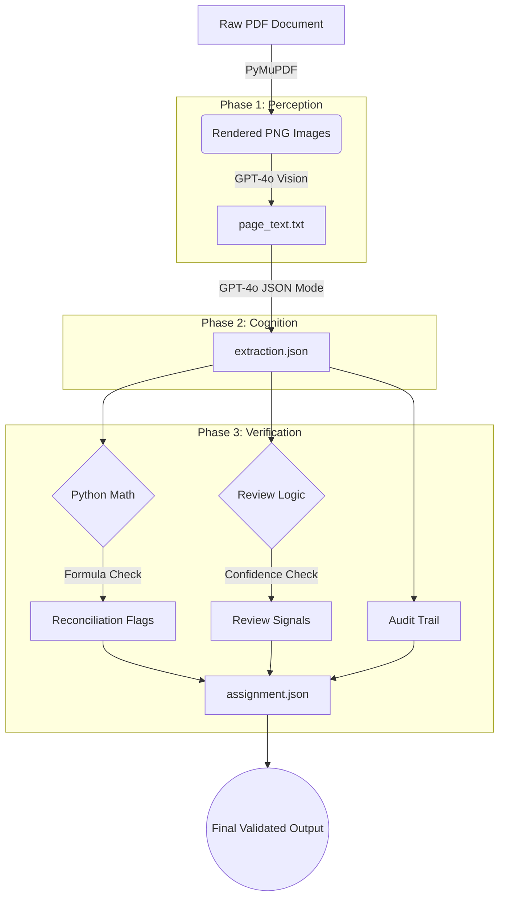

# Mortgage Extractor Design Document

## Architecture Overview

The `mortgage-extractor` pipeline is a 3-phase system designed to reliably extract, structure, and verify data from complex financial PDFs. 

It splits the problem of document understanding into three distinct responsibilities:
1. **Perception** (Phase 1)
2. **Cognition** (Phase 2)
3. **Verification** (Phase 3)

This architectural split solves the core issues inherent in legacy OCR pipelines (which fail on visual layout perception) and raw LLM extraction (which hallucinates on math and verification).

---

## Phase 1: Ingestion & Vision Transcription (Perception)

**Goal:** Produce a 100% accurate text representation of the document, including layout context, footnotes, handwritten edits, and stamps.

**Design Choices:**
- **PyMuPDF (`fitz`):** Used to render each page of the PDF into high-quality PNGs (200 DPI). Rendering as an image bypasses the hidden formatting nightmares of PDF text layers.
- **OpenAI `gpt-4o` Vision:** Reads the rendered images and transcribes the text. The Vision model naturally understands tables, two-column layouts, and visual hierarchy, solving the "reading order" problem that plagues traditional OCR tools like Tesseract.
- **Output:** A combined `page_text.txt` string with `[PAGE N]` markers injected so the downstream models retain page provenance.

---

## Phase 2: LLM Data Extraction (Cognition)

**Goal:** Read the unstructured text, understand the financial intent, locate specific fields, and output them in a structured schema.

**Design Choices:**
- **Strict JSON Mode:** `gpt-4o` is invoked with `response_format={"type": "json_object"}`. This guarantees parsable output that maps perfectly to our `pydantic` schemas.
- **Prompt Engineering for Corrections:** The system prompt explicitly instructs the LLM to look for revision language ("REVISED to", "supersedes"). When it finds a correction, it records the new value but also explicitly logs the `original_value`, marks `correction_applied=True`, and writes a `decision_reason`.
- **Reconciliation Formulas:** The LLM is asked to identify mathematical relationships in the document (e.g., LTV calculation, sum of closing costs) and define them. It does **not** do the math. It only extracts the stated inputs, the stated total, and the string formula. This prevents LLM arithmetic hallucinations.

---

## Phase 3: Deterministic Verification & Assembly (Verification)

**Goal:** Ensure mathematical correctness, flag fields that need human review, and generate an auditable final artifact without ANY LLM usage.

**Design Choices:**
- **Zero LLM Policy:** Phase 3 is pure, deterministic Python.
- **Native Decimal Math:** Python's `decimal.Decimal` module is used for all arithmetic to avoid floating-point precision errors.
- **Mathematical Reconciliation (`reconciler.py`):** The system parses the formulas provided by Phase 2, runs the arithmetic dynamically, and compares the `computed` total against the `as_stated` total. If the difference is `> 0.01`, a discrepancy is logged.
- **Review Signals (`review.py`):** Automatically analyzes the fields to determine if a human needs to look at the document. It flags fields based on low confidence, missing values, corrections applied, or reconciliation discrepancies, generating `critical`, `high`, or `medium` priority signals.
- **Audit Trail (`audit.py`):** Generates an immutable log (`audit_trail`) that records what model (`gpt-4o`) and what prompt version (`v1.0`) were used to extract each field, ensuring compliance in regulated environments.
- **Final Assembly (`assembler.py`):** Combines the extraction, reconciliations, review signals, and audit trail into a single `assignment.json` that is strictly typed and ready for downstream integration.
